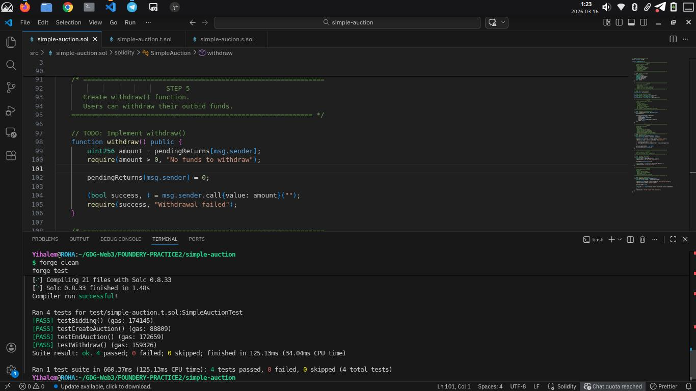
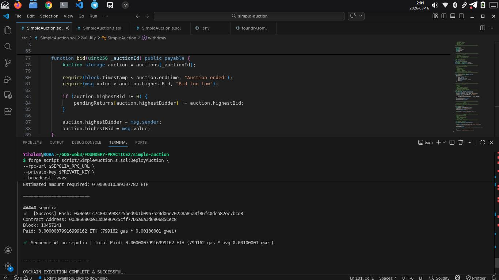
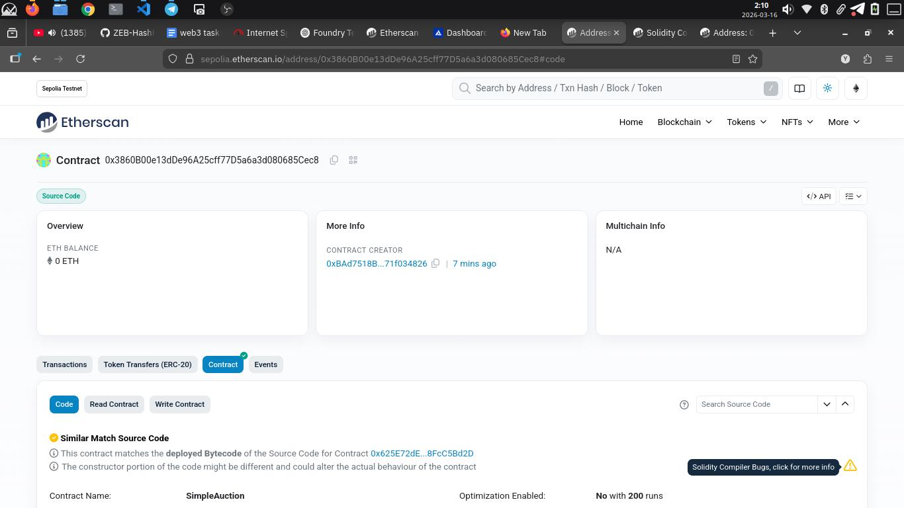

# Simple Auction

A simple Ethereum **Auction** smart contract that allows users to **create auctions, place bids, withdraw outbid funds, and end auctions securely**. This project demonstrates **Solidity basics**, **mapping for state tracking**, and **unit testing with Foundry**.

---

## 📖 About the Project

The **Simple Auction** smart contract is a Solidity project built with **Foundry**. Each auction tracks the **seller, highest bidder, highest bid, and end time**. Users can place bids higher than the current highest bid, withdraw funds if outbid, and end auctions once they expire. All operations are enforced using **require statements** for safety and correctness.

The project includes **unit tests** and a **deployment script** for local and testnet deployment.

---

## 🎯 Learning Goals

This project demonstrates:

- Solidity fundamentals: structs, mappings, functions, and events
- Tracking multiple auctions with `mapping(uint256 => Auction)`
- Handling refundable bids using `mapping(address => uint256)`
- Input validation with `require()`
- Writing unit tests with **Foundry** (`forge test`)
- Deploying and verifying contracts on **Sepolia** testnet using `forge`

---

## ⚙️ Features

### User Features

- **Create Auction:** Sellers can create auctions with a specified duration
- **Place Bid:** Users can place bids higher than the current highest bid
- **Withdraw Funds:** Outbid users can withdraw their refundable bids
- **End Auction:** Sellers can end auctions after the end time, transferring highest bid

### Optional Features

- **Events:** Emitting events on bids and withdrawals for transparency

---

## 🛠️ Technology Stack

- **Solidity:** ^0.8.20
- **Development Tool:** Foundry (forge, cast, anvil)
- **Testing Framework:** Forge Std (`Test.sol`)
- **Blockchain:** Sepolia Testnet for deployment

---

## 📂 Project Structure

```text
simple-auction
│
├── src
│   └── SimpleAuction.sol        # Solidity contract
│
├── script
│   └── SimpleAuction.s.sol      # Deployment script using Foundry
│
├── test
│   └── simple-auction.t.sol     # Unit tests
│
├── lib
│   └── forge-std                # Foundry standard library
│
├── screenshots                  # Screenshots of deployment, tests, verification
│
├── .env                         # Environment variables (PRIVATE_KEY, RPC_URL, ETHERSCAN_API_KEY)
├── foundry.toml                 # Foundry project configuration
└── README.md                    # Project documentation
```

## 📜 Smart Contract Design

- **Auction struct:** stores `seller`, `highestBidder`, `highestBid`, `endTime`, `ended`
- **auctions mapping:** tracks multiple auctions
- **pendingReturns mapping:** tracks refundable funds for outbid users

### Core Functions

| Function         | Description                                      |
| ---------------- | ------------------------------------------------ |
| `creatAuction()` | Creates a new auction with a given duration      |
| `bid()`          | Places a bid higher than current highest bid     |
| `withdraw()`     | Withdraws previous highest bid if outbid         |
| `endAuction()`   | Ends auction and transfers highest bid to seller |

**Security:** Only the seller can end the auction; users can only withdraw their own funds.
Deployment & Testing

**Compile & Test Contract**

```text
forge build
forge test -vv
```

**✅ Tests verify**:

```text
Auction creation
Bidding logic
Withdraw funds
End auction
```

**Deploy on Sepolia Testnet**

```text
forge script script/SimpleAuction.s.sol:DeployAuction \
--rpc-url $SEPOLIA_RPC_URL \
--private-key $PRIVATE_KEY \
--broadcast -vvvv
```

**Deployed contract address**:0x3860B00e13dDe96A25cff77D5a6a3d080685Cec8

**Verify on Etherscan**
https://sepolia.etherscan.io/address/0x3860B00e13dDe96A25cff77D5a6a3d080685Cec8#code

### Interacting With the Contract\*\*

**Read State**

```text
cast call 0x3860B00e13dDe96A25cff77D5a6a3d080685Cec8 "auctionCount() returns (uint256)"
cast call 0x3860B00e13dDe96A25cff77D5a6a3d080685Cec8 "auctions(uint256) returns (address,address,uint256,uint256,bool)"
```

## Write Functions

# Create Auction

```text
cast send 0x3860B00e13dDe96A25cff77D5a6a3d080685Cec8 "creatAuction(uint256)" 86400 \
--private-key $PRIVATE_KEY --rpc-url $SEPOLIA_RPC_URL
```

# Place Bid

```text
cast send 0x3860B00e13dDe96A25cff77D5a6a3d080685Cec8 "bid(uint256)" 1 \
--value 1000000000000000000 --private-key $PRIVATE_KEY --rpc-url $SEPOLIA_RPC_URL
```

# Withdraw Funds

```text
cast send 0x3860B00e13dDe96A25cff77D5a6a3d080685Cec8 "withdraw()" \
--private-key $PRIVATE_KEY --rpc-url $SEPOLIA_RPC_URL
```

# End Auction

```text
cast send 0x3860B00e13dDe96A25cff77D5a6a3d080685Cec8 "endAuction(uint256)" 1 \
--private-key $PRIVATE_KEY --rpc-url $SEPOLIA_RPC_URL
```

#### Screenshots / Evidence

- **Test Results**
  Shows the outcome of all unit tests verifying auction functionality.
  

- **Deployment Screenshot**
  Confirms the successful deployment of the SimpleAuction contract.
  

- **Etherscan Verification**
  Displays the contract verified on Etherscan for transparency.
  

### Submission Checklist

SimpleAuction.sol (smart contract)
SimpleAuction.t.sol (unit tests)
SimpleAuction.s.sol (deployment script)
Deployed contract address
Test results and screenshots
Etherscan verification link

👤 Author

Yihalem M

📄 License

MIT License

```

```
