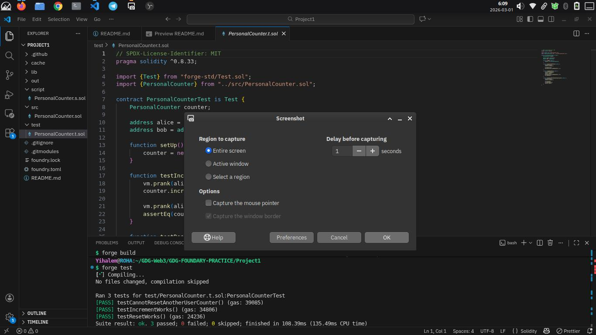

# Project 1 — Personal Counter

A simple Ethereum **Personal Counter** smart contract that allows each user to **track and manage their own counter**. This project demonstrates **Solidity basics**, **user-specific state**, and **unit testing with Foundry**.

---

## 📖 About the Project

The **Personal Counter** smart contract is a Solidity project built with **Foundry**. Each user has a private counter stored on-chain. Users can **increment** or **reset** their own counter but cannot modify others' counters. All actions are **enforced using require statements** and can optionally emit events for transparency.

The project includes **unit tests** to verify functionality and a **deployment script** for local testing.

---

## 🎯 Learning Goals

This project demonstrates:

- Solidity fundamentals: mappings, functions, modifiers, and events
- User-specific data storage using `mapping(address => uint256)`
- Input validation with `require()`
- Writing unit tests with **Foundry** (`forge test`)
- Deploying and interacting with contracts locally using `forge` and `anvil`

---

## ⚙️ Features

### User Features

- **Increment Counter:** Users can increment their personal counter by 1
- **Reset Counter:** Users can reset their counter to 0
- **Get Counter:** Users can check their current counter value
- **Access Control:** Users cannot modify other users' counters

### Optional Features

- **Events:** Emitting events on increment or reset for transparency

---

## 🛠️ Technology Stack

- **Solidity:** ^0.8.33
- **Development Tool:** Foundry (forge, cast, anvil)
- **Local Blockchain:** Anvil
- **Testing Framework:** Forge Std (`Test.sol`)

---

## 📂 Project Structure

```text
Project1/
├── src/
│   └── PersonalCounter.sol
├── test/
│   └── PersonalCounter.t.sol
├── script/
│   └── PersonalCounter.s.sol
├── foundry.toml
├── foundry.lock
└── README.md
```

## 📜 Smart Contract Design

- **counters:** `mapping(address => uint256)` storing each user’s counter

### Core Functions

| Function              | Description                      |
| --------------------- | -------------------------------- |
| `increment()`         | Increments caller's counter by 1 |
| `reset()`             | Resets caller's counter to 0     |
| `getCounter(address)` | Returns the counter of a user    |

**Security:** Users cannot modify others' counters (`require(msg.sender == ...)`)

---

## 🚀 Deployment & Testing

1. **Start local blockchain:**

```bash
anvil
```

2. **Compile & Test Contract**

```bash
forge build
forge test -vv
✅ Tests verify:
- Increment works
- Reset works
- Users cannot reset another user's counter

```

3. **Deploy Contract Locally**

```bash
forge script script/PersonalCounter.s.sol \
 --rpc-url http://127.0.0.1:8545 \
 --private-key <YOUR_ANVIL_KEY> \
 --broadcast

```

4. **Interact with Contract**

#### Increment Counter

```bash
cast send <CONTRACT_ADDRESS> "increment()" \
 --private-key <YOUR_ANVIL_KEY> \
 --rpc-url http://127.0.0.1:8545
```

#### Reset Counter

```bash
cast send <CONTRACT_ADDRESS> "reset()" \
 --private-key <YOUR_ANVIL_KEY> \
 --rpc-url http://127.0.0.1:8545
```

#### Check Counter Value

cast call <CONTRACT_ADDRESS> "getCounter(address)" <USER_ADDRESS> \
 --rpc-url http://127.0.0.1:8545

---

## 📸 Screenshots (Evidence)

**Test Results**


---

## 📂 Submission Checklist

- `PersonalCounter.sol` (smart contract source code)
- `PersonalCounter.t.sol` (unit tests)
- `PersonalCounter.s.sol` (deployment script)
- Deployed contract address
- Test results from `forge test`

---

## 👤 Author

**Yihalem M**

---

## 📄 License

MIT License

```

```
