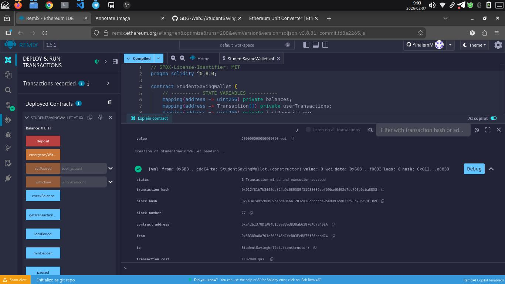
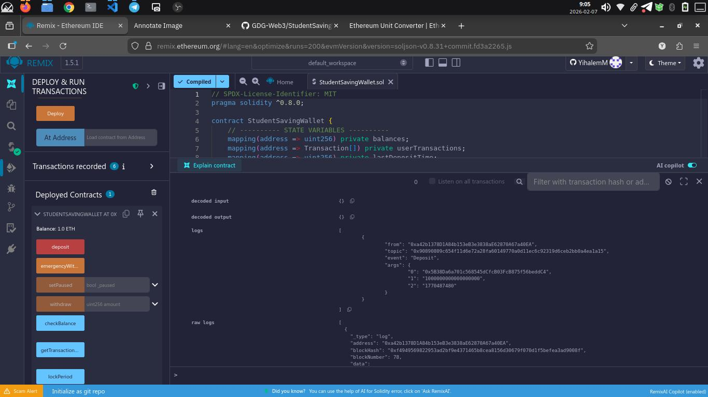
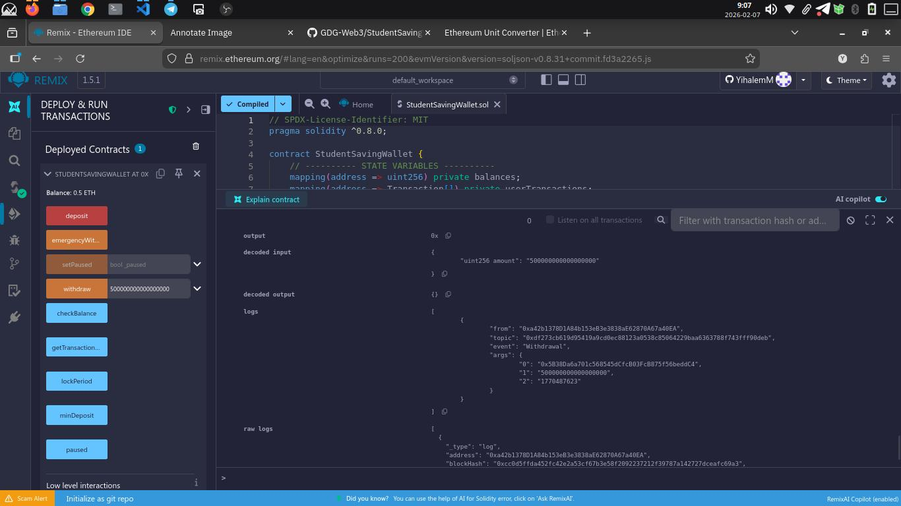

# Decentralized Student Savings Wallet (DSSW)

A simple Ethereum smart contract that allows students to **securely save, withdraw, and track ETH** in a decentralized manner. This project demonstrates practical Web3 concepts such as **self-custody, transparency, and trustless execution**.

---

## 📖 About the Project

The **Decentralized Student Savings Wallet (DSSW)** is a Solidity-based smart contract designed to simulate a decentralized savings system. Users can deposit ETH, withdraw funds when needed, and view their transaction history directly on the blockchain.

The wallet operates **without intermediaries**. All funds remain under the control of the user’s Ethereum address, and every transaction is **permanently recorded** on the Ethereum blockchain. The contract is deployed on the **Sepolia Ethereum Testnet** and interacted with using **MetaMask** and **Remix IDE**.

---

## 🎯 Learning Goals

This project demonstrates:

- Wallet ownership and user control in decentralized systems
- Solidity fundamentals: **mappings, structs, arrays, and functions**
- Secure handling of ETH deposits and withdrawals
- Smart contract interaction using **Remix** and **MetaMask**
- Deployment to a public Ethereum test network (**Sepolia**)

---

## ⚙️ Features

### User Features

- **Deposit ETH:** Save funds securely in your personal wallet on-chain. A minimum deposit amount is required to prevent spam or tiny deposits.
- **Withdraw ETH:** Retrieve funds only if sufficient balance exists and the time-lock period has passed.
- **Check Balance:** View your current wallet balance at any time.
- **Transaction History:** Track all past deposits and withdrawals for transparency.
- **Blockchain Events:** Every deposit and withdrawal emits an event that records the sender, amount, and timestamp for verifiable records.

### Owner-Only Features

- **Emergency Withdraw:** Allows the contract owner to withdraw funds in case of an emergency.
- **Pause/Unpause:** The owner can pause or resume contract operations when necessary.

---

## 🛠️ Technology Stack

- **Solidity:** ^0.8.x
- **Development Tool:** Remix IDE
- **Wallet:** MetaMask
- **Blockchain Network:** Sepolia Ethereum Testnet
- **Platform:** Ethereum (EVM compatible)

---

## 📂 Project Structure

```text
StudentSavingsWallet/
├── contracts/
│   └── StudentSavingsWallet.sol       # Main smart contract written in Solidity
├── screenshots/
│   ├── deployment.png                 # Screenshot showing contract deployed successfully
│   ├── deposit.png                    # Screenshot of ETH deposit interaction
│   └── withdraw.png                   # Screenshot of ETH withdrawal interaction
└── README.md                          # This project documentation file

```

## 📜 Smart Contract Design

### Data Storage

- **Balances:** A mapping to store ETH balances for each user address
- **Transactions:** A struct and array to record deposit and withdrawal activities

### Core Functions

| Function                   | Description                               |
| -------------------------- | ----------------------------------------- |
| `deposit()`                | Deposit ETH into the wallet               |
| `withdraw(uint256 amount)` | Withdraw ETH if sufficient balance exists |
| `checkBalance()`           | Returns the caller’s wallet balance       |
| `getTransactionHistory()`  | Returns all recorded transactions         |

**Explanation:**

- `deposit()` allows users to send ETH to their personal wallet stored on-chain.
- `withdraw(uint256 amount)` ensures only available funds can be withdrawn and updates balances before transferring ETH to prevent reentrancy attacks.
- `checkBalance()` provides a quick view of the wallet’s current ETH balance for the user.
- `getTransactionHistory()` returns all deposit and withdrawal records for transparency and accountability.

---

## 🔐 Security Considerations

- Balance is **updated before transfer** to avoid reentrancy attacks.
- Solidity ^0.8.x provides **built-in overflow and underflow protection**.
- Withdrawals are restricted to **available balances only**.
- Every transaction emits events to allow external tracking and monitoring.

---

## 🚀 Deployment Information

- **Network:** Sepolia Ethereum Testnet
- **Contract Name:** StudentSavingsWallet
- **Contract Address:** `0xa42b1378D1A84b153eB3e3838aE62870A67a40EA`
- **Deployment Transaction Hash:** `0x012f81b7b3442dd824a9c080389f51938086cef69ba46492d7de793b0cba8833e`

---

## 🧪 How to Use the Contract

1. Open **Remix IDE** in your browser.
2. Connect **MetaMask** and switch to the **Sepolia network**.
3. Compile and deploy the `StudentSavingsWallet.sol` contract.
4. Call `deposit()` with ETH to save funds.
5. Call `withdraw(amount)` to retrieve ETH when needed.
6. Use `checkBalance()` to view wallet balance.
7. Call `getTransactionHistory()` to see all recorded transactions.

> All interactions are **transparent** and verifiable on the blockchain.

---

## 📸 Screenshots (Evidence)

- **Contract Deployment Confirmation**  
  

- **ETH Deposit Transaction (1 ETH)**  
  This shows a successful deposit of 1 ETH into the DSSW wallet.  
  The contract emits a `Deposit` event, which records the sender's address, the amount, and a timestamp.

  

- **ETH Withdrawal Transaction (0.5 ETH)**  
  This shows a successful withdrawal of 0.5 ETH from the DSSW wallet.  
  The contract emits a `Withdrawal` event, which records the sender's address, the amount withdrawn, and a timestamp.

  

---

## ✨ Implemented Enhancements

### General Enhancements

- Minimum deposit amount to prevent spam deposits
- Time-lock mechanism for withdrawals
- Extended transaction filtering (by date, type, or amount)

### Owner-Only Functions

- **Emergency Withdraw:** Allows the contract owner to withdraw funds in case of an emergency
- **Pause/Unpause Function:** The owner can pause or resume contract operations when necessary

---

## 📂 Submission Checklist

- Solidity smart contract source code
- Deployed contract address
- Deployment transaction hash
- Screenshots showing successful interaction

---

## 👤 Author

**Yihalem M**  
Final-Year Engineering Student  
Web3 & Blockchain Developer

---

## 📄 License

This project is licensed under the **MIT License**.
