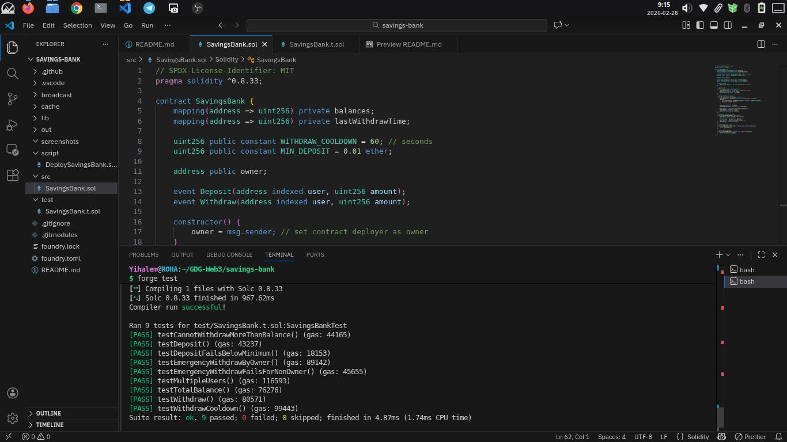

# Savings Bank - Ethereum Smart Contract

A simple Ethereum **Savings Bank** smart contract that allows users to **deposit, withdraw, and track ETH** in a decentralized and secure manner. This project demonstrates **Web3 concepts** such as self-custody, trustless execution, and transparency.

---

## 📖 About the Project

The **Savings Bank** smart contract is a Solidity-based project built with **Foundry**. Users can deposit ETH, withdraw their funds while respecting balance and cooldown rules, and check their balances. All actions are **recorded on-chain**, and events are emitted for deposits and withdrawals.

The project includes **unit tests** to verify functionality and a **deployment script** for local or testnet deployment.

---

## 🎯 Learning Goals

This project demonstrates:

- Solidity fundamentals: mappings, functions, events, and modifiers
- Handling ETH deposits and withdrawals securely
- Implementing cooldowns and owner-only functions
- Writing unit tests with **Foundry**
- Deploying and interacting with smart contracts using `forge` and `anvil`

---

## ⚙️ Features

### User Features

- **Deposit ETH:** Users can deposit ETH into their personal account.
- **Minimum Deposit:** Deposits must meet a minimum threshold.
- **Withdraw ETH:** Users can withdraw ETH up to their balance.
- **Withdrawal Cooldown:** Prevents frequent withdrawals (1 minute cooldown).
- **Check Balance:** Users can check their balance at any time.
- **Total Balance:** The contract tracks total ETH stored.
- **Events:** Deposits and withdrawals emit events with sender, amount, and timestamp.

### Owner-Only Features

- **Emergency Withdraw:** Allows the owner to withdraw all funds.
- **Access Control:** Only the owner can call emergency withdraw.

---

## 🛠️ Technology Stack

- **Solidity:** ^0.8.33
- **Development Tool:** Foundry (forge, cast, anvil)
- **Local Blockchain:** Anvil
- **Testing Framework:** Forge Std (`Test.sol`)

---

## 📂 Project Structure

```text
savings-bank/
├── src/
│   └── SavingsBank.sol          # Main smart contract
├── test/
│   └── SavingsBank.t.sol        # Unit tests
├── script/
│   └── DeploySavingsBank.s.sol  # Deployment script
├── screenshots/                 # Screenshots of tests, deployment, and outputs
└── README.md
```

## 📜 Smart Contract Design

### Data Storage

- **balances:** Tracks ETH balance per user.
- **lastWithdrawal:** Tracks last withdrawal timestamp for cooldown.
- **owner:** Contract deployer for emergency actions.

### Core Functions

| Function                | Description                                             |
| ----------------------- | ------------------------------------------------------- |
| `deposit()`             | Deposit ETH into the user's account                     |
| `withdraw(uint256 amt)` | Withdraw ETH if sufficient balance and cooldown elapsed |
| `getBalance(address)`   | Returns the balance of a specific user                  |
| `getTotalBalance()`     | Returns total ETH stored in the contract                |
| `emergencyWithdraw()`   | Owner-only function to withdraw all ETH                 |

## 🔐 Security Considerations

- Update balances **before transfers** to prevent reentrancy attacks.
- Withdrawals restricted by **balance** and **cooldown**.
- Owner-only functions enforced via access control.
- Solidity ^0.8.x provides built-in overflow/underflow protection.
- Every deposit and withdrawal emits **events** for transparency.

---

## 🚀 Deployment Instructions

### 1. Start Local Blockchain

```bash
anvil
```

- Keep this terminal running while deploying or interacting with contracts.
- Note the **RPC URL** (default: `http://127.0.0.1:8545`) and **private keys** — needed for deployment/testing.

---

### 2. Compile & Test Contract

````bash
forge build
forge test -vv
✅ Tests verify:

- Deposits work
- Withdrawals work
- Over-withdrawal prevented
- Balance updates correctly
- Total contract balance tracked
- Owner-only emergency withdraw
- Withdrawal cooldown enforced

---

### 3. Deploy Contract Locally

```bash
forge script script/DeploySavingsBank.s.sol \
  --rpc-url http://127.0.0.1:8545 \
  --private-key <YOUR_ANVIL_KEY> \
  --broadcast
  - Copy the contract address from the output.
- Example: `0x700b6A60ce7EaaEA56F065753d8dcB9653dbAD35`

---

### 4. Interact with Contract

#### Deposit ETH

```bash
cast send <CONTRACT_ADDRESS> "deposit()" --value 1ether \
  --private-key <YOUR_ANVIL_KEY> \
  --rpc-url http://127.0.0.1:8545
  #### Withdraw ETH

```bash
cast send <CONTRACT_ADDRESS> "withdraw(uint256)" 0.5ether \
  --private-key <YOUR_ANVIL_KEY> \
  --rpc-url http://127.0.0.1:8545
  #### Check User Balance

```bash
cast call <CONTRACT_ADDRESS> "getBalance(address)" <USER_ADDRESS> \
  --rpc-url http://127.0.0.1:8545
  #### Check Contract Total Balance

```bash
cast call <CONTRACT_ADDRESS> "totalBalance()" \
  --rpc-url http://127.0.0.1:8545

  ## 📸 Screenshots (Evidence)

- **Test Results**
  

---

## ✨ Bonus Features

- Minimum deposit requirement: `require(msg.value >= 0.01 ether, "Deposit too small")`
- Withdrawal cooldown enforced (e.g., 1 minute)
- Owner-only emergency withdrawal

---

## 📂 Submission Checklist

- Solidity smart contract source code
- Deployed contract address
- Deployment transaction hash
- Screenshots showing successful interaction
- Test results from `forge test`

---

## 👤 Author

**Yihalem M**

---

## 📄 License

MIT License
````
